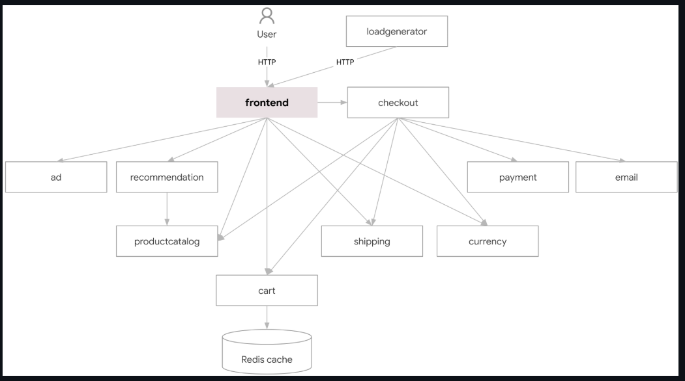
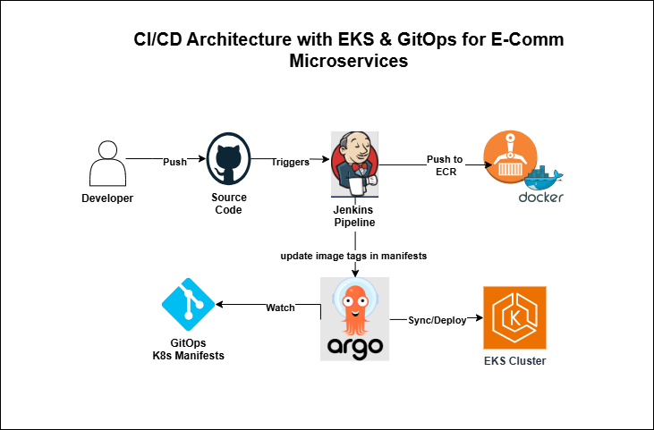
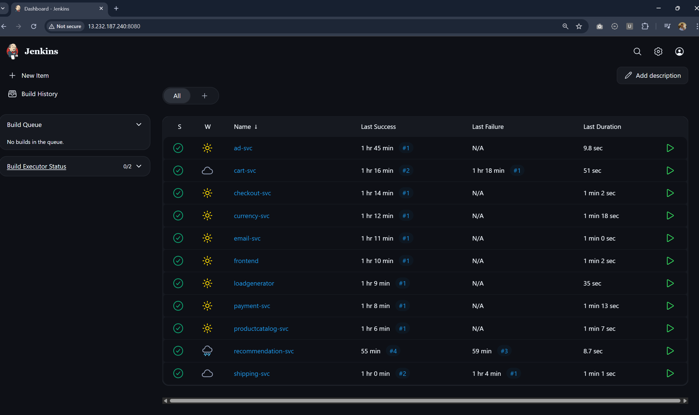
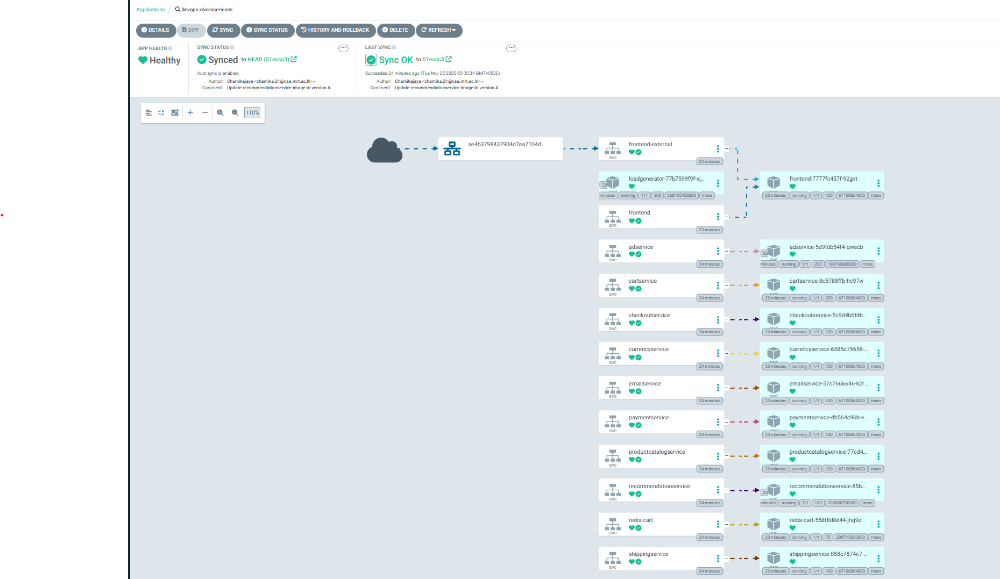

# 🚀 DevOps Microservices CI/CD Pipeline

A complete end-to-end DevOps pipeline implementing CI/CD best practices for a microservices-based e-commerce application using Jenkins, ArgoCD, Kubernetes (EKS), and Terraform on AWS.


_Application Dashboard_

---

## 📋 Table of Contents

- [Overview](#overview)
- [Architecture](#architecture)
- [Technologies Used](#technologies-used)
- [Prerequisites](#prerequisites)
- [Project Structure](#project-structure)
- [Installation Guide](#installation-guide)
  - [1. Terraform State Backend Setup](#1-terraform-state-backend-setup)
  - [2. Infrastructure Provisioning with Terraform](#2-infrastructure-provisioning-with-terraform)
  - [3. Jenkins Configuration](#3-jenkins-configuration)
  - [4. GitOps with ArgoCD](#4-gitops-with-argocd)
  - [5. Application Deployment](#5-application-deployment)
- [Microservices Overview](#microservices-overview)
- [CI/CD Pipeline Flow](#cicd-pipeline-flow)
- [Cleanup](#cleanup)
- [License](#license)

---

## 🎯 Overview

This project demonstrates a production-grade DevOps implementation for deploying and managing microservices applications. It showcases:

- **Infrastructure as Code (IaC)** using Terraform
- **Continuous Integration** with Jenkins
- **Continuous Deployment** with ArgoCD (GitOps)
- **Container Orchestration** with Amazon EKS
- **Container Registry** with Amazon ECR

---

## 🏗️ Architecture

### Application Architecture


_Microservices Application Architecture_

The application consists of 11 microservices written in different languages:

- **Frontend** (Go) - Web UI for the e-commerce platform
- **Product Catalog Service** (Go) - Product inventory management
- **Cart Service** (C#/.NET) - Shopping cart functionality
- **Checkout Service** (Go) - Order processing
- **Payment Service** (Node.js) - Payment processing
- **Email Service** (Python) - Email notifications
- **Shipping Service** (Go) - Shipping cost calculation
- **Currency Service** (Node.js) - Currency conversion
- **Recommendation Service** (Python) - Product recommendations
- **Ad Service** (Java) - Advertisement serving
- **Load Generator** (Python/Locust) - Load testing

### DevOps Pipeline Architecture


_Complete CI/CD Pipeline Flow_

**Pipeline Workflow:**

1. Developer pushes code to GitHub
2. Jenkins detects changes and triggers build
3. Jenkins builds Docker image
4. Image is pushed to Amazon ECR
5. Jenkins updates Kubernetes manifests in Git (GitOps)
6. ArgoCD detects manifest changes
7. ArgoCD deploys to EKS cluster
8. Application is accessible via AWS Load Balancer

---

## 🛠️ Technologies Used

| Category                    | Technologies                           |
| --------------------------- | -------------------------------------- |
| **Cloud Provider**          | AWS (EKS, ECR, EC2, VPC, S3, DynamoDB) |
| **Infrastructure as Code**  | Terraform                              |
| **CI/CD**                   | Jenkins, ArgoCD                        |
| **Container Orchestration** | Kubernetes (Amazon EKS)                |
| **Container Runtime**       | Docker                                 |
| **Version Control**         | Git, GitHub                            |

---

## ✅ Prerequisites

Before starting, ensure you have the following installed and configured:

- **AWS Account** with appropriate permissions
- **AWS CLI** (v2.x or later) - [Installation Guide](https://docs.aws.amazon.com/cli/latest/userguide/getting-started-install.html)
- **Terraform** (v1.0 or later) - [Download](https://www.terraform.io/downloads)
- **kubectl** (v1.27 or later) - [Installation Guide](https://kubernetes.io/docs/tasks/tools/)
- **Git** - [Download](https://git-scm.com/downloads)
- **Docker** (for local testing) - [Installation Guide](https://docs.docker.com/get-docker/)
- **SSH Key Pair** in AWS for EC2 access

**AWS Permissions Required:**

- EC2 (full access)
- EKS (full access)
- ECR (full access)
- VPC (full access)
- IAM (full access)
- S3 (full access)
- DynamoDB (full access)

---

## 📖 Installation Guide

### 1. Terraform State Backend Setup

#### Why Do We Need a Terraform State Backend?

Terraform state is critical for tracking the current state of your infrastructure. Using a remote backend (S3 + DynamoDB) provides:

- **State Locking**: Prevents concurrent modifications using DynamoDB
- **Collaboration**: Multiple team members can work on the same infrastructure
- **State Versioning**: S3 versioning allows state recovery
- **Security**: Encryption at rest and in transit
- **Disaster Recovery**: Remote backup of infrastructure state

#### 1.1: Navigate to Backend Setup Directory

```bash
cd terraform/backend-setup
```

#### 1.2: Initialize Terraform

```bash
terraform init
```

#### 1.3: Review the Planned Changes

```bash
terraform plan
```

This will create:

- **S3 Bucket**: `hiros-devops-microservices-tfstate-2024` (with versioning and encryption)
- **DynamoDB Table**: `terraform-locks-table` (for state locking)

#### 1.4: Apply the Configuration

```bash
terraform apply
```

Type `yes` when prompted.

#### 1.5: Verify Resources

```bash
# Verify S3 bucket
aws s3 ls | grep devops-microservices-tfstate

# Verify DynamoDB table
aws dynamodb list-tables | grep terraform-locks
```

**Expected Output:**

```
S3 Bucket: hiros-devops-microservices-tfstate-2024
DynamoDB Table: terraform-locks-table
```

---

### 2. Infrastructure Provisioning with Terraform

#### 2.1: Navigate to Main Terraform Directory

```bash
cd ..  # Back to terraform/
```

#### 2.2: Configure Variables

Edit `terraform.tfvars` to customize your deployment:

```hcl
aws_region = "ap-south-1"
project_name = "devops-microservices"
environment = "dev"
vpc_cidr = "10.0.0.0/16"
key_name = "your-ssh-key-name"  # Replace with your AWS key pair name
allowed_ssh_cidr = "your-ip/32"  # Replace with your IP for security
```

#### 2.3: Initialize Terraform with Remote Backend

```bash
terraform init
```

This connects to the S3 backend created in Step 1.

#### 2.4: Review Infrastructure Plan

```bash
terraform plan
```

This will create:

- **VPC**: Custom VPC with public and private subnets across 2 AZs
- **EC2 Instance**: `t2.large` instance for Jenkins (with Docker, Jenkins, kubectl pre-installed)
- **EKS Cluster**: Kubernetes cluster
- **EKS Node Group**: 2 worker nodes (t2.large) with auto-scaling (1-10 nodes)
- **ECR Repositories**: 11 repositories for each microservice
- **IAM Roles**: Necessary roles and policies for EKS and EC2
- **Security Groups**: Configured for Jenkins and EKS access

#### 2.5: Apply Infrastructure Configuration

```bash
terraform apply
```

Type `yes` when prompted.

**⏱️ Note**: This process takes approximately **15-20 minutes** to complete.

#### 2.6: Save Important Outputs

```bash
terraform output
```

**Save these values:**

```
jenkins_server_public_ip = "xx.xx.xx.xx"
jenkins_server_public_dns = "ec2-xx-xx-xx-xx.ap-south-1.compute.amazonaws.com"
eks_cluster_name = "devops-microservices-dev-eks-cluster"
eks_cluster_endpoint = "https://xxxxx.ap-south-1.eks.amazonaws.com"
ecr_repository_urls = {
  adservice = "497237776404.dkr.ecr.ap-south-1.amazonaws.com/devops-microservices-dev-adservice"
  cartservice = "497237776404.dkr.ecr.ap-south-1.amazonaws.com/devops-microservices-dev-cartservice"
  # ... (other services)
}
```

---

### 3. Jenkins Configuration

#### 3.1: SSH into Jenkins Server

```bash
ssh -i /path/to/your-key.pem ec2-user@<jenkins-public-ip>
```

Replace `<jenkins-public-ip>` with the IP from Terraform output.

#### 3.2: Verify Jenkins Installation

```bash
# Check Jenkins status
sudo systemctl status jenkins

# Check Docker status
sudo systemctl status docker

# Verify kubectl
kubectl version --client
```

#### 3.3: Get Jenkins Initial Admin Password

```bash
sudo cat /var/lib/jenkins/secrets/initialAdminPassword
```

Copy this password.

#### 3.4: Access Jenkins Web UI

Open your browser and navigate to:

```
http://<jenkins-public-ip>:8080
```

1. Paste the initial admin password
2. Click "Install suggested plugins"
3. Create an admin user
4. Complete the setup wizard

#### 3.5: Install Required Jenkins Plugins

Go to **Manage Jenkins** → **Manage Plugins** → **Available Plugins**

Install the following plugins:

- Docker Pipeline
- Pipeline: AWS Steps
- Git
- GitHub Integration
- Credentials Binding

#### 3.6: Configure AWS Credentials in Jenkins

1. Go to **Manage Jenkins** → **Manage Credentials**
2. Click **(global)** → **Add Credentials**

**Add AWS Access Key ID:**

- Kind: `Secret text`
- Secret: `<your-aws-access-key-id>`
- ID: `aws-access-key-id`
- Description: `AWS Access Key ID`

**Add AWS Secret Access Key:**

- Kind: `Secret text`
- Secret: `<your-aws-secret-access-key>`
- ID: `aws-secret-access-key`
- Description: `AWS Secret Access Key`

**Add GitHub Personal Access Token:**

- Kind: `Username with password`
- Username: `<your-github-username>`
- Password: `<your-github-personal-access-token>`
- ID: `github-pat`
- Description: `GitHub PAT for updating manifests`

#### 3.7: Create Jenkins Pipelines


_Jenkins Dashboard with All Microservice Pipelines_

For **each microservice**, create a pipeline:

1. Click **New Item**
2. Enter name: `<service-name>-pipeline` (e.g., `frontend-pipeline`)
3. Select **Pipeline**
4. Click **OK**

**Pipeline Configuration:**

- **Definition**: `Pipeline script from SCM`
- **SCM**: `Git`
- **Repository URL**: `https://github.com/<your-username>/microservices-pipeline.git`
- **Branch**: `*/main`
- **Script Path**: `jenkinsfiles/<service-name>.groovy`

Click **Save**.

**Repeat for all 11 microservices:**

- adservice-pipeline
- cartservice-pipeline
- checkoutservice-pipeline
- currencyservice-pipeline
- emailservice-pipeline
- frontend-pipeline
- loadgenerator-pipeline
- paymentservice-pipeline
- productcatalogservice-pipeline
- recommendationservice-pipeline
- shippingservice-pipeline

#### 3.8: Configure ECR Repository URLs

Update each Groovy pipeline file (`jenkinsfiles/*.groovy`) with your ECR repository URLs from Terraform output.

Example for `frontend.groovy`:

```groovy
environment {
    REPO_URL = "<your-account-id>.dkr.ecr.ap-south-1.amazonaws.com/devops-microservices-dev-frontend"
    // ... other environment variables
}
```

#### 3.9: Run Initial Builds

1. Navigate to each pipeline in Jenkins
2. Click **Build Now**
3. Monitor the build progress in **Console Output**

**Pipeline Stages:**

1. ✅ Clean Workspace
2. ✅ Checkout Code
3. ✅ Build Docker Image
4. ✅ Push to ECR
5. ✅ Update Deployment Manifest (GitOps)

---

### 4. GitOps with ArgoCD

#### Why GitOps?

GitOps provides:

- **Declarative Infrastructure**: All desired state is stored in Git
- **Version Control**: Complete audit trail of all changes
- **Automated Deployment**: Changes in Git automatically trigger deployments
- **Easy Rollbacks**: Simply revert Git commits to roll back
- **Single Source of Truth**: Git repository is the source of truth
- **Enhanced Security**: No direct cluster access needed for deployments

#### 4.1: Configure kubectl for EKS

On your **local machine** (not Jenkins server, make sure that kubectl is installed first):

```bash
aws eks update-kubeconfig --region ap-south-1 --name devops-microservices-dev-eks-cluster
```

Verify connection:

```bash
kubectl get nodes
```

**Expected Output:**

```
NAME                                          STATUS   ROLES    AGE   VERSION
ip-10-0-11-xxx.ap-south-1.compute.internal   Ready    <none>   5m    v1.27.x
ip-10-0-12-xxx.ap-south-1.compute.internal   Ready    <none>   5m    v1.27.x
```

#### 4.2: Create Namespace for ArgoCD

```bash
kubectl create namespace argocd
```

#### 4.3: Install ArgoCD

```bash
kubectl apply -n argocd \
  -f https://raw.githubusercontent.com/argoproj/argo-cd/stable/manifests/install.yaml
```

#### 4.4: Verify ArgoCD Installation

```bash
# Check if all pods are running
kubectl get pods -n argocd
```

Wait until all pods show `Running` status .

```bash
# List all ArgoCD resources
kubectl get all -n argocd
```

#### 4.5: Expose ArgoCD Server Using LoadBalancer

Edit the ArgoCD server service:

```bash
kubectl edit svc argocd-server -n argocd
```

**Find this line:**

```yaml
type: ClusterIP
```

**Change it to:**

```yaml
type: LoadBalancer
```

Save and exit .

#### 4.6: Get ArgoCD Load Balancer URL

```bash
kubectl get svc argocd-server -n argocd
```

**Expected Output:**

```
NAME            TYPE           CLUSTER-IP      EXTERNAL-IP                                                              PORT(S)
argocd-server   LoadBalancer   10.100.xx.xx    xxxxx-xxxxx.ap-south-1.elb.amazonaws.com                                80:xxxxx/TCP,443:xxxxx/TCP
```

Copy the `EXTERNAL-IP` (DNS name).

#### 4.7: Access ArgoCD UI

Open your browser and navigate to:

```
https://<argocd-loadbalancer-dns>
```

**Note**: You may see a certificate warning. Click "Advanced" → "Proceed" .

#### 4.8: Get ArgoCD Admin Password

```bash
kubectl get secret argocd-initial-admin-secret -n argocd \
  -o jsonpath="{.data.password}" | base64 -d && echo
```

**Login Credentials:**

- **Username**: `admin`
- **Password**: (output from the above command)

---

### 5. Application Deployment

#### 5.1: Create Application Namespace

```bash
kubectl create namespace dev
```

Verify:

```bash
kubectl get namespaces
```

#### 5.2: Create ArgoCD Application


_ArgoCD Application Network Topology_

1. Open ArgoCD UI
2. Click **+ NEW APP**
3. Fill in the following details:

**General:**

- **Application Name**: `microservices-app`
- **Project Name**: `default`
- **Sync Policy**: `Automatic`
  - ☑️ Prune Resources
  - ☑️ Self Heal

**Source:**

- **Repository URL**: `https://github.com/<your-username>/microservices-pipeline.git`
- **Revision**: `HEAD`
- **Path**: `k8s`

**Destination:**

- **Cluster URL**: `https://kubernetes.default.svc`
- **Namespace**: `dev`

4. Click **CREATE**

#### 5.3: Monitor Synchronization

ArgoCD will automatically:

1. Clone the Git repository
2. Detect all Kubernetes manifests in `k8s/` directory
3. Apply them to the cluster
4. Monitor for any drift

**Sync Status:**

- ✅ **Synced**: Application is deployed and healthy
- 🔄 **Syncing**: Deployment in progress
- ❌ **OutOfSync**: Manual intervention needed

#### 5.4: Verify Deployments

```bash
# Check all pods in dev namespace
kubectl get pods -n dev

# Check all services
kubectl get svc -n dev

# Check deployments
kubectl get deployments -n dev
```

**Expected Output:**

```
NAME                    READY   STATUS    RESTARTS   AGE
adservice-xxx           1/1     Running   0          2m
cartservice-xxx         1/1     Running   0          2m
checkoutservice-xxx     1/1     Running   0          2m
currencyservice-xxx     1/1     Running   0          2m
emailservice-xxx        1/1     Running   0          2m
frontend-xxx            1/1     Running   0          2m
loadgenerator-xxx       1/1     Running   0          2m
paymentservice-xxx      1/1     Running   0          2m
productcatalogservice-xxx 1/1   Running   0          2m
recommendationservice-xxx 1/1   Running   0          2m
redis-cart-xxx          1/1     Running   0          2m
shippingservice-xxx     1/1     Running   0          2m
```

#### 5.5: Access the Application

Get the frontend LoadBalancer URL:

```bash
kubectl get svc frontend-external -n dev
```

**Expected Output:**

```
NAME                TYPE           CLUSTER-IP      EXTERNAL-IP                                                              PORT(S)
frontend-external   LoadBalancer   10.100.xx.xx    xxxxx-xxxxx.ap-south-1.elb.amazonaws.com                                80:xxxxx/TCP
```

Copy the `EXTERNAL-IP` and open it in your browser:

```
http://<frontend-loadbalancer-dns>
```

🎉 **Congratulations!** Your microservices application is now live!

---

## 🔬 Microservices Overview

| Service              | Language | Description                       | Port  |
| -------------------- | -------- | --------------------------------- | ----- |
| **Frontend**         | Go       | Web UI and business logic         | 8080  |
| **Product Catalog**  | Go       | Product inventory and search      | 3550  |
| **Cart Service**     | C#/.NET  | Shopping cart management          | 7070  |
| **Checkout Service** | Go       | Order placement and orchestration | 5050  |
| **Payment Service**  | Node.js  | Payment processing mock           | 50051 |
| **Email Service**    | Python   | Email confirmation service        | 8080  |
| **Shipping Service** | Go       | Shipping cost calculator          | 50051 |
| **Currency Service** | Node.js  | Multi-currency support            | 7000  |
| **Recommendation**   | Python   | ML-based product recommendations  | 8080  |
| **Ad Service**       | Java     | Contextual advertisement          | 9555  |
| **Load Generator**   | Python   | Locust-based load testing         | 8089  |
| **Redis Cart**       | Redis    | Session state storage             | 6379  |

---

## 🔄 CI/CD Pipeline Flow

### Continuous Integration (Jenkins)

```
┌─────────────┐
│   Developer │
│  Pushes Code│
└──────┬──────┘
       │
       ▼
┌─────────────────┐
│  GitHub Webhook │
│   Triggers      │
└──────┬──────────┘
       │
       ▼
┌─────────────────┐
│ Jenkins Pipeline│
│                 │
│ 1. Clean WS     │
│ 2. Checkout     │
│ 3. Build Image  │
│ 4. Push to ECR  │
│ 5. Update K8s   │
└──────┬──────────┘
       │
       ▼
┌─────────────────┐
│   Git Commit    │
│ (New Image Tag) │
└─────────────────┘
```

### Continuous Deployment (ArgoCD)

```
┌─────────────────┐
│   Git Repo      │
│  (k8s/*.yaml)   │
└──────┬──────────┘
       │
       ▼
┌─────────────────┐
│    ArgoCD       │
│  Auto-Detect    │
│    Changes      │
└──────┬──────────┘
       │
       ▼
┌─────────────────┐
│  EKS Cluster    │
│  Apply Changes  │
└──────┬──────────┘
       │
       ▼
┌─────────────────┐
│   Application   │
│  Updated! 🚀    │
└─────────────────┘
```

---

## 🧹 Cleanup

To avoid AWS charges, destroy all resources when done:

### 1. Delete ArgoCD Application

```bash
# Delete the application
kubectl delete -n argocd application microservices-app

# Delete all resources in dev namespace
kubectl delete namespace dev
```

### 2. Uninstall ArgoCD

```bash
kubectl delete -n argocd -f https://raw.githubusercontent.com/argoproj/argo-cd/stable/manifests/install.yaml
kubectl delete namespace argocd
```

### 3. Destroy Terraform Infrastructure

```bash
cd terraform/

# Destroy main infrastructure
terraform destroy

# Destroy S3 backend (optional - if you want to remove state storage)
cd backend-setup/
terraform destroy
```

**⚠️ Warning**: This will delete all resources including:

- EKS Cluster and Node Groups
- EC2 Jenkins Server
- VPC and Subnets
- ECR Repositories (and all images)
- IAM Roles

---

## 📝 License

This project is licensed under the MIT License - see the [LICENSE](LICENSE) file for details.

---

## 🙏 Acknowledgments

- Inspired by Google's [Microservices Demo](https://github.com/GoogleCloudPlatform/microservices-demo)
- ArgoCD community for excellent GitOps tooling
- HashiCorp for Terraform
- Jenkins community for CI/CD automation

**Built with ❤️ by Chamika Jayasinghe**
